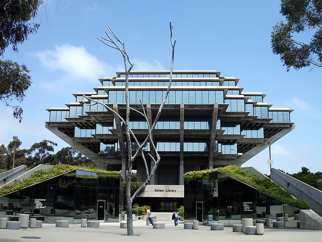
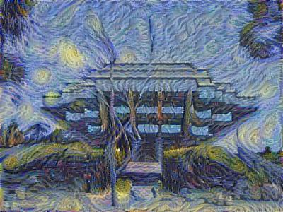

# Neural-Style-Tranfer-From-Scratch
I build a NST with VGG-19 from scratch

There are a lot of existing NST libraries/modules avaible for Python, but **for the sake of understanding it and understanding how Deep CNN works in terms of identifing features**, I build this project almost from scratch(here I downloaded pretrained data for my own model to increase efficiency and save training time)

**Link to the pretrained VGG-19 model can be found [here](http://www.vlfeat.org/matconvnet/pretrained/)**

For details/how it is built, please go to the notebook

## Disclaim
I wrote all the code in the Notebook, but codes in nst_utils(which are only several helper methods) are borrowed online to increase efficiency

## What does this project do?

and

equals

## Can't open?
Cannot open notebook/To view on phone, click [here](https://nbviewer.jupyter.org/github/Rabona17/Neural-Style-Tranfer-From-Scratch/blob/master/Neural-Style-Transfer_From_Scratch.ipynb)
